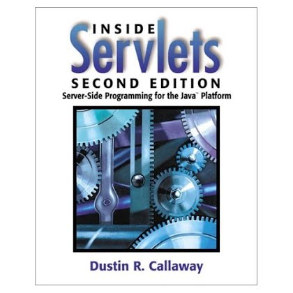

## DUSTIN R. CALLAWAY
E-mail: drcallaway@gmail.com • GitHub: https://github.com/drcallaway

### EXPERIENCE SUMMARY
I have a broad technical background ranging from Java/JEE programming to Microsoft .NET Windows development to Android mobile applications. With more than fifteen years of comprehensive Web/backend development experience, I have designed, developed, and deployed many successful Internet solutions using JEE (servlets/JSP/EJB/REST/SOAP), ASP.NET (C#), PHP, Flex, Node.js, and HTML/JavaScript/Ajax. I am well versed in database and application server technologies and I am the author of the book Inside Servlets: Server-Side Programming for the Java Platform published by Addison-Wesley.

### PROFESSIONAL EXPERIENCE
**Staff Software Engineer**, Intuit, Inc., Small Business Financial Services division, Orem, Utah\
*March 2007 - Present*\
• Developed content driven architecture for next generation TurboTax product\
• Developed engine for rendering tax forms in Flex for display on any Flash-enabled client\
• Created an iOS application that retrieves tax forms via a web service and renders them on the iPhone\
• Developed Java Persistence API (JPA) layer for persisting and retrieving tax information\
• Created RESTful web service to manage debit card accounts (SOAP client to Visa backend)\
• Created scalable email management system for managing email campaigns\
• Co-developed an Android application for managing TurboTax debit cards\
• Designed and developed REST partner APIs for the Intuit Payment Network using Grails/Groovy\
• Created mobile-optimized application for outbound QuickBooks payments using Node.js, Express, Angular, and MongoDB\

**Staff Software Engineer**, Sybase, Inc. (now SAP), eBanking Group, Orem, Utah\
*June 1999 - March 2007*\
• Developed, deployed, and maintained complex J2EE-based online banking systems\
• Designed and developed an online check register used by E*TRADE and Bank of America Military Bank\
• Designed and developed the Content Aggregation Server – a product that aggregates content from several service providers and returns the result within a single XML response\
• Developed the EJB Profile Server – a product that provides flexible storage and retrieval of customer information via an application framework and collection of Enterprise JavaBeans\

**Senior Consultant**, Uinta Business Systems, Inc., Orem, Utah\
*May 1998 - June 1999*\
• Developed Internet/intranet applications using Java servlets, JDBC, and RMI\
• Created high availability Web sites with the Sun NetDynamics application server\
• Configured and deployed Web-based applications on Windows NT and Solaris systems\
• Modeled databases using Erwin and deployed on Oracle 7.x/8.x or SQL Server 6.5/7\
• Developed various Java applications including an automated SMTP mail host, Java GUI protocol troubleshooting utility, and Java HTTP server\

**Senior Web Developer**, Nu Skin International, Inc., Provo, Utah\
*May 1997 - May 1998*\
• Developed Internet/intranet applications in Java, WebLogic Application Server, and Oracle\
• Created Java servlets for web-enabling various Human Resources functions\
• Re-wrote much of the company's 100% Java server architecture (converted to Servlet API)\
• Provided consulting services in Visual Basic and Access to other teams\

**Senior Consultant**, Provider Solutions, Inc., Provo, Utah\
*Feb. 1996 - May 1997*\
• Developed client/server applications using Visual Basic 4/5, Access 95/97, and Oracle 7\
• Performed project management and analysis responsibilities on many projects\
• Taught Microsoft Certified Visual Basic and SQL Server courses\
• Developed and maintained the company intranet\

**Consultant**, Systems Resources Consulting, Downers Grove, Illinois\
*Feb. 1995 - Feb. 1996*\
• Developed client/server applications using Visual Basic 3/4, Access 2/95, and SQL Server\
• Designed and created a variety of business databases in Microsoft Access\

**Consultant**, Arthur Andersen, Tax Technology Group, Chicago, Illinois\
*Aug. 1994 - Feb. 1995*\
• Software development and consulting for Arthur Andersen offices wordwide\
• Created and distributed CDs that automatically configure workstations at remote offices\

### TECHNICAL SKILLS
Languages: Java, C#, VB, JavaScript, ActionScript/MXML, Groovy, Objective-C, SQL, HTML, XML, XSLT, CSS, PHP\
Application Servers: Glassfish, WebSphere, WebLogic, JBoss, Tomcat, Resin, Jetty, IIS\
Databases: DB2, Oracle, SQL Server, MySQL\
Development Tools: IntelliJ IDEA, Eclipse, NetBeans, Visual Studio\

### EDUCATION
Bachelor of Science, Brigham Young University, Provo, Utah\
August 1994\
Major: Computer Science\
Major/Overall GPA: 3.65/3.55 (4.0 scale)\
